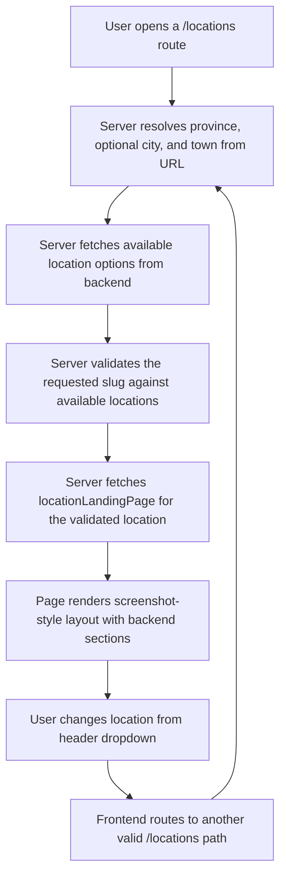

## 1. Product Overview
Rebuild the public location landing page so it visually matches the provided screenshot while staying fully powered by the existing `locationLandingPage` backend query and current header location selector.
- The page must present town-specific tombstone content in a familiar, search-first marketplace layout for shoppers comparing nearby manufacturers, listings, cemeteries, and related locations.
- The value is a clearer, more SEO-friendly public landing experience that feels grounded in the existing brand and uses only real backend data.

## 2. Core Features

### 2.1 Feature Module
1. **Location landing page**: breadcrumb trail, compact title/stat line, town image banner, intro text, branch list, listing grid, cemeteries list, FAQ, nearby town links.
2. **Header location selector**: province and location chooser that only shows backend-available locations and routes directly into valid `/locations/...` pages.
3. **SEO metadata layer**: route-level title, description, canonical, breadcrumb-aware metadata generated from backend fields.

### 2.2 Page Details
| Page Name | Module Name | Feature description |
|-----------|-------------|---------------------|
| Location landing page | Header selector | Show only backend-available province/city/town choices; collapse duplicate city-town levels like Bhamshela; navigate directly to valid location routes |
| Location landing page | Breadcrumb | Render compact breadcrumb path near the top of the content column using backend `location.breadcrumb` |
| Location landing page | Town heading block | Show town title, short statistics line, town hero image, and backend intro copy in the tight, editorial layout shown in the screenshot |
| Location landing page | Branch list | Show actual local branches from `branches` with company name, branch name, logo, address, phone, and hours in a compact vertical stack |
| Location landing page | Listings grid | Show tombstone cards from `listings.items` in a dense card grid with image, price, listing title, and company context, linking by `listing.slug` |
| Location landing page | Cemeteries section | Show local cemetery information sourced from backend compatibility/business data without inventing extra records |
| Location landing page | FAQ section | Render short FAQ entries directly from backend `faq` |
| Location landing page | Nearby locations | Render compact internal links to `nearbyLocations` using backend `slug` only |

## 3. Core Process
The visitor lands on a `/locations/...` route, the server validates the route against backend-supported location data, fetches one location page model, and renders a town-specific page that mirrors the screenshot layout. The visitor can then switch locations in the header, review branches and listings, read FAQs, and move to nearby towns.

## 4. User Interface Design

### 4.1 Design Style
- Primary colors: existing TombstonesFinder teal, amber CTA, white background, dark gray text
- Button style: compact rectangular search controls and slim bordered action links matching the screenshot
- Font and sizes: preserve existing brand/header fonts where already used, but shift page body to small, dense, marketplace-style typography
- Layout style: desktop-first, narrow central content column with stacked sections and compact card grid rather than large modern panels
- Icon style suggestions: minimal utility icons only where already useful; the screenshot should feel content-led, not icon-led

### 4.2 Page Design Overview
| Page Name | Module Name | UI Elements |
|-----------|-------------|-------------|
| Location landing page | Header row | Existing global header with integrated `Locations` dropdown and the compact selected location summary |
| Location landing page | Search strip | Thin top search/filter strip directly beneath header, aligned to the current brand and screenshot proportions |
| Location landing page | Hero/content intro | Left-aligned breadcrumb, bold town title, short stats line, wide banner image, and constrained intro paragraph |
| Location landing page | Branch list | Plain white background, tight spacing, vertical branch cards that feel informational rather than promotional |
| Location landing page | Listings grid | Dense 2-4 column card grid with product images on top, price emphasis, and small company metadata |
| Location landing page | Cemeteries + FAQ + nearby | Simple stacked text-led sections with restrained spacing to match the screenshot’s lower-page structure |

### 4.3 Responsiveness
- Desktop-first implementation, because the screenshot defines the primary layout
- Tablet and mobile must preserve section order while collapsing columns safely
- The compact desktop hierarchy should remain readable without introducing fake content or redesigning the information model

