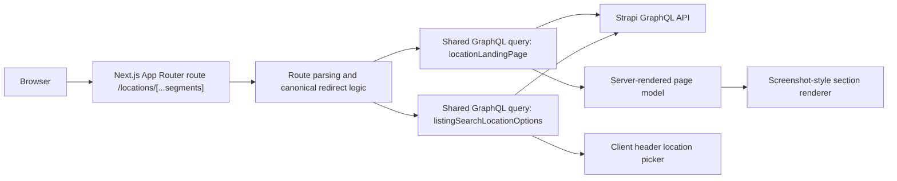
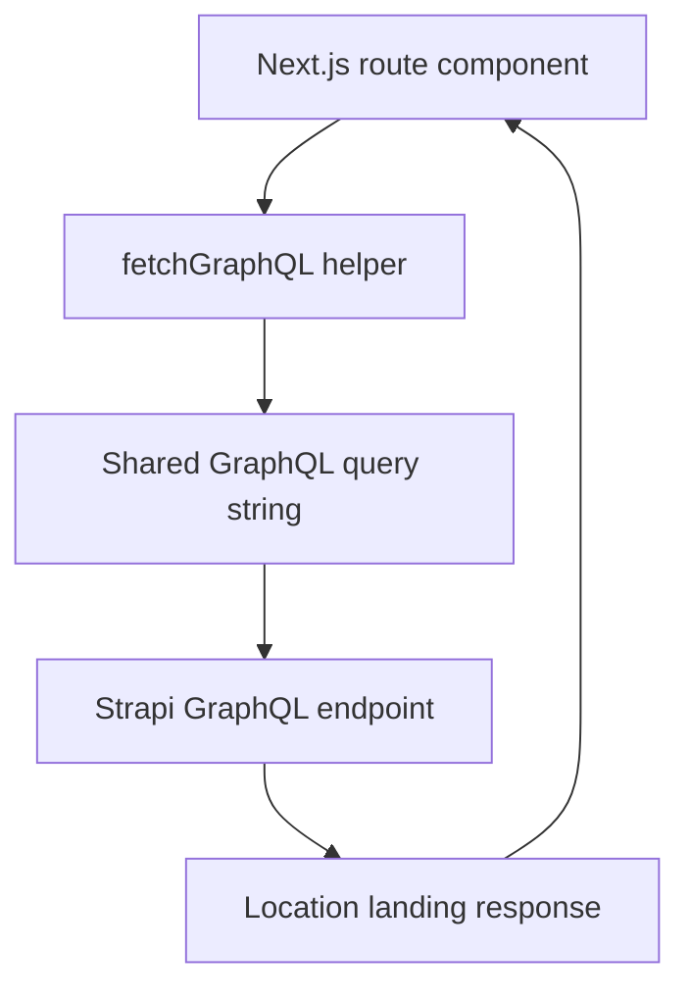
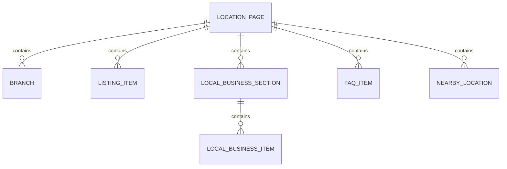

## 1. Architecture Design
The location landing page remains a Next.js App Router server-rendered route. The route consumes a shared GraphQL query file, renders a screenshot-inspired content layout, and relies on the existing client-side header location picker for navigation between backend-supported locations.



## 2. Technology Description
- Frontend: use existing project tech,Tailwind utilities etc...
- Data fetching: server `fetchGraphQL()` helper for route data, Apollo client query for the header location picker
- Query source: `graphql/queries/locationLandingPage.ts` and existing `LISTING_SEARCH_LOCATION_OPTIONS_QUERY`
- Initialization Tool: existing Memorial project structure

## 3. Route Definitions
| Route | Purpose |
|-------|---------|
| `/locations/[province]/[town]` | Canonical route for province-to-town pages when backend collapses duplicate city/town |
| `/locations/[province]/[city]/[town]` | Canonical route for province-to-city-to-town pages when city context is distinct |

## 4. API Definitions

### 4.1 Location Landing Page Query
```ts
type LocationLandingPageVariables = {
  province: string;
  city?: string | null;
  town: string;
  page?: number;
  pageSize?: number;
};

type LocationLandingPageResponse = {
  locationLandingPage: {
    location: {
      province: string | null;
      city: string | null;
      town: string | null;
      slug: string | null;
      breadcrumb: Array<{ label: string | null; slug: string | null }>;
    } | null;
    statistics: {
      totalBranches: number | null;
      totalManufacturers: number | null;
      totalListings: number | null;
      minimumListingPrice: number | null;
    } | null;
    seo: {
      title: string | null;
      metaTitle: string | null;
      metaDescription: string | null;
      intro: string | null;
      heroImage: { url: string | null } | null;
    } | null;
    branches: Array<{
      branch: { documentId: string | null; name: string | null } | null;
      company: { documentId: string | null; name: string | null; slug: string | null } | null;
      address: string | null;
      phone: string | null;
      openingHours: {
        monToFri: string | null;
        saturday: string | null;
        sunday: string | null;
        publicHoliday: string | null;
      } | null;
      logo: { url: string | null } | null;
    }>;
    listings: {
      items: Array<{
        listing: {
          documentId: string | null;
          title: string | null;
          slug: string | null;
          price: number | null;
          thumbnail: { url: string | null } | null;
        } | null;
        branch: { documentId: string | null; name: string | null; address: string | null } | null;
        company: {
          documentId: string | null;
          name: string | null;
          slug: string | null;
          logo: { url: string | null } | null;
        } | null;
      }>;
      pagination: {
        page: number | null;
        pageSize: number | null;
        total: number | null;
        pageCount: number | null;
      } | null;
    } | null;
    localBusinessSections: Array<unknown>;
    faq: Array<{ question: string | null; answer: string | null }>;
    nearbyLocations: Array<{
      town: string | null;
      city: string | null;
      province: string | null;
      slug: string | null;
      listingCount: number | null;
    }>;
  } | null;
};
```

### 4.2 Header Location Options Query
```ts
type ListingSearchLocationOptionsResponse = {
  listingSearchLocationOptions: Array<{
    province: string | null;
    cities: Array<{
      city: string | null;
      towns: Array<{ town: string | null }>;
    }>;
  }>;
};
```

## 5. Server Architecture Diagram
This frontend does not introduce a custom backend layer. The route talks directly to Strapi GraphQL through the existing shared fetch helper.



## 6. Data Model

### 6.1 Data Model Definition


### 6.2 Data Definition Notes
- No new database tables are introduced in the frontend project
- The redesign must keep using the existing backend response shape without frontend joins or synthetic fallback records
- The header location selector must sanitize and collapse duplicate city/town structures using the existing location hierarchy sanitizer before rendering
- The screenshot-style redesign must remain compatible with:
  - `location.slug` canonical redirects
  - `listing.slug` public listing links
  - backend-driven pagination in `listings.pagination`
